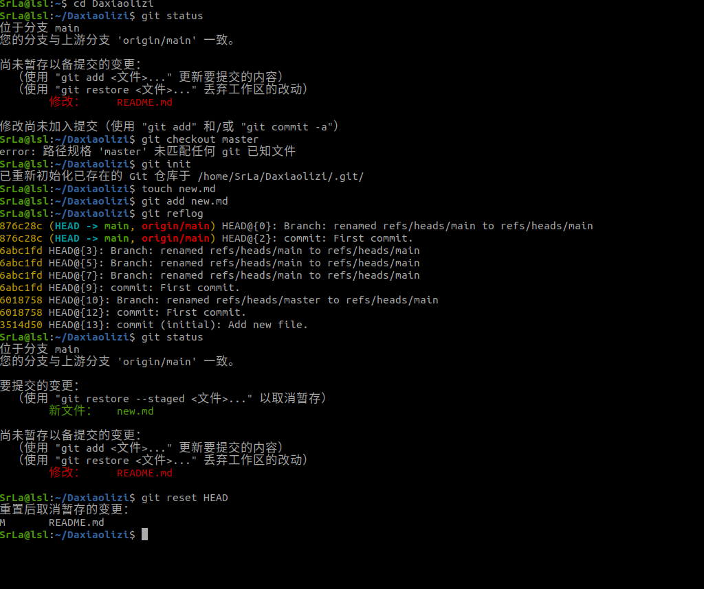
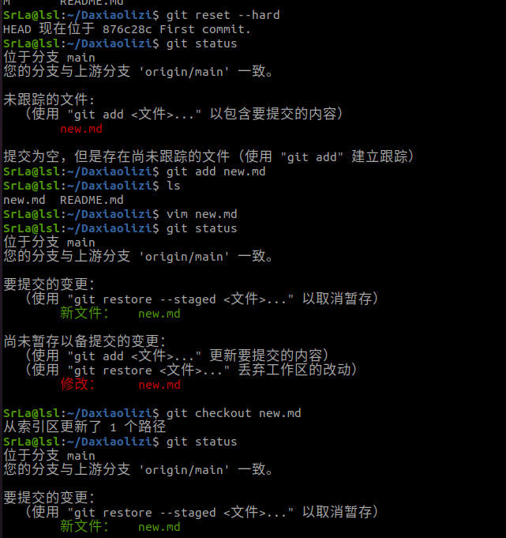
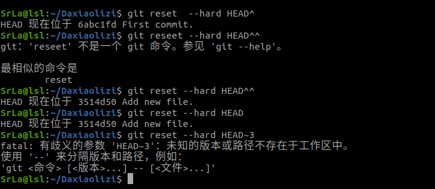
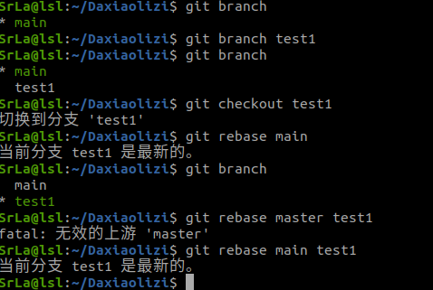

## 1.若你已经修改了部分文件、并且将其中的一部分加入了暂存区，应该如何回退这些修改，恢复到修改前最后一次提交的状态？给出至少两种不同的方式

第一种：git reset HEAD #将此次修改的file退回到工作区

第二种：使用 git checkout <文件名>#退回到上一次commit后的环境（回退所有已提交的缓存区内容）

## 2.若你已经提交了一个新版本，需要回退该版本，应该如何操作？分别给出不修改历史或修改历史的至少两种不同的方式

第一种(修改历史）：git reset  --hard  HEAD（版本）#此处HEAD为当前提交版本

第二种（不修改历史）：git revert HEAD #此处HEAD为上一次提交版本

## 3.我们已经知道了合并分支可以使用 merge，但这不是唯一的方法，给出至少两种不同的合并分支的方式

第一种：git checkout [branch]     

​               git rebase  main/master(主线) [branch]

第二种：git merge --squash

